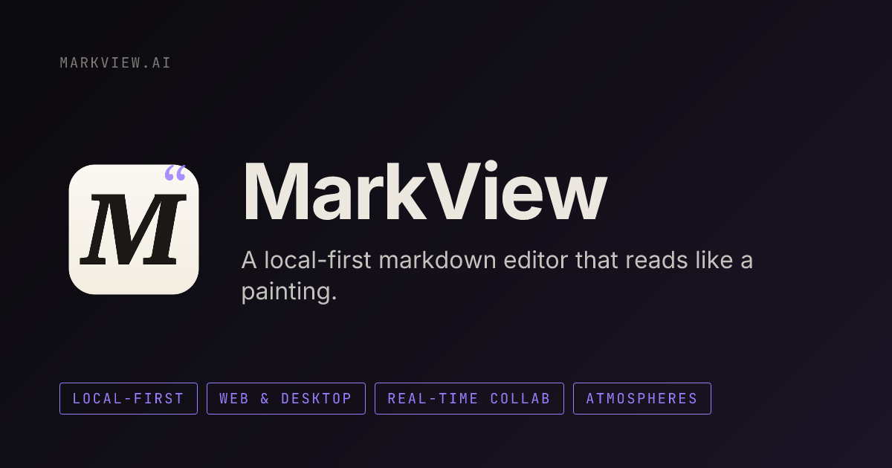

<div align="center">

# MarkView

**The embeddable Markdown rendering stack & native macOS app.**

**A high-performance markdown engine available as a React Component, Web Component, and native Desktop App. Features GitHub-flavored rendering, WYSIWYG editing, Custom Themes, and 15 MCP tools for AI assistants.**

[](LICENSE)
[](https://www.npmjs.com/package/@markview/core)
[](https://www.npmjs.com/package/@markview/react)
[](https://www.npmjs.com/package/@markview/webcomponent)
[](https://www.npmjs.com/package/@markview/mcp)
[](https://github.com/abgnydn/markview/actions/workflows/ci.yml)
[](apps/web/src/__tests__)
[](CONTRIBUTING.md)
[](https://nextjs.org)
[](apps/mcp)
[](https://getmarkview.vercel.app)

<br />



</div>

---

## ✨ Features

### Rendering & Viewing
- 📝 **GitHub-flavored markdown** with full spec support
- 🧜 **Mermaid diagrams** rendered inline
- 🔢 **KaTeX math** — inline and block equations
- 🎨 **Syntax highlighting** via Shiki (140+ languages)
- 📊 **Tables, alerts, footnotes** — all GitHub extensions

### Workspace Management
- 📂 **Multi-tab workspaces** with nested file trees
- 💾 **Persistent sessions** via IndexedDB (survives refresh)
- 🔗 **Inter-document linking** — click links between docs
- 📎 **Drag & drop** file upload, open folders, or reorder files
- 🐙 **GitHub import** — paste a repo URL, instantly load docs
- 📋 **Workspace templates** — README, API Docs, Changelog, Meeting Notes, Tech Spec, Blog Post
- 🔗 **URL sharing** — share workspaces via URL (gzip + base64url in hash)
- 🤝 **P2P Collaboration** — real-time multiplayer editing via WebRTC, zero server required

### Productivity
- 🔍 **Full-text search** across all documents (⌘K)
- ↔️ **Split view** — compare two files side by side
- 📊 **Diff view** — unified diff with line-by-line highlighting
- ✏️ **Built-in editor** — edit, split, and preview modes with formatting toolbar (⌘B/⌘I/⌘K)
- 🎬 **Presentation mode** — transform headings into slides
- 🧘 **Focus mode** — distraction-free reading
- ⌨️ **Keyboard-first** — navigate files, switch workspaces, adjust font size
- 📋 **Export everywhere** — PDF, Word, PowerPoint, PNG, SVG, HTML, RST, AsciiDoc, static site, or print
- 💬 **Annotations** — highlight text, add color-coded notes, persisted per file
- 📜 **Version history** — automatic snapshots on save, restore previous versions
- 🎨 **Custom themes** — 6 curated presets (Dracula, Nord, Monokai, Solarized, Rosé Pine)

### Extensibility
- 🔌 **Plugin system** — register custom code-fence renderers (alert, chart, tabs, timeline built-in)
- 🎬 **Embed support** — YouTube, Figma, CodePen, CodeSandbox, Loom via ` ```embed `

### Desktop App
- 🖥️ **Native macOS app** — built with Tauri v2, fast and lightweight
- 📂 **Default opener** — set MarkView as your system-default `.md` file handler
- 🍏 **Mac App Store** — Coming soon for a one-time purchase of $4.99
- 🚀 **Build from source** — completely un-gated for developers to compile locally

### Privacy & Offline
- 🔒 **Zero accounts** — no sign-up required
- ☁️ **Zero cloud** — files never leave the browser
- 📡 **Zero telemetry** — no tracking, no analytics
- ✈️ **Works offline** — full PWA support

---

## 🚀 Quick Start

### Web App

```bash
cd apps/web
npm install
npm run dev
```

Open [http://localhost:3000](http://localhost:3000) — drop some markdown files and go.

Or use the **[live demo](https://getmarkview.vercel.app)** — no install needed.

### Native macOS App (Recommended)

MarkView ships as a proper native macOS app via Tauri — set it as your default `.md` opener:

```bash
# Build the .app + .dmg
npm run desktop:build

# Install to /Applications
sudo cp -r apps/desktop/src-tauri/target/release/bundle/macos/MarkView.app /Applications/

# Register file associations
/System/Library/Frameworks/CoreServices.framework/Frameworks/LaunchServices.framework/Support/lsregister -f /Applications/MarkView.app
```

Then right-click any `.md` file → **Get Info** → **Open With** → **MarkView** → **Change All**.

For development:
```bash
npm run desktop:dev
```

### Install as PWA

MarkView also works as a Progressive Web App — install it from Chrome/Edge for an offline-capable app-like experience.

### Chrome Extension

Load `apps/extension` as an unpacked extension in Chrome to view `.md` files directly in the browser.

### MCP Server

The MCP server lets AI assistants read, search, and manage your markdown documentation. First, build it:

```bash
cd apps/mcp
npm install
npm run build
```

Then add it to your AI tool:

<details>
<summary><strong>Claude Desktop</strong></summary>

Edit `~/Library/Application Support/Claude/claude_desktop_config.json`:

```json
{
  "mcpServers": {
    "markview": {
      "command": "node",
      "args": ["/absolute/path/to/markview/apps/mcp/dist/index.js", "/path/to/your/docs"]
    }
  }
}
```

Restart Claude Desktop. You'll see "markview" in the MCP tools menu (🔧).

</details>

<details>
<summary><strong>Cursor</strong></summary>

Go to **Settings → MCP Servers → Add Server** and use:

```json
{
  "command": "node",
  "args": ["/absolute/path/to/markview/apps/mcp/dist/index.js", "/path/to/your/docs"]
}
```

</details>

<details>
<summary><strong>Any MCP-compatible client</strong></summary>

```json
{
  "mcpServers": {
    "markview": {
      "command": "node",
      "args": ["path/to/markview/apps/mcp/dist/index.js", "./your-docs"]
    }
  }
}
```

</details>

**What you can ask your AI:**

> *"Search my docs for authentication setup"*
> *"What are the headings in API.md?"*
> *"Find all broken links in my documentation"*
> *"Create a new doc called getting-started.md with an intro section"*
> *"Show me all code examples in Python across my docs"*

---

## 🤖 MCP Tools (15)

The Model Context Protocol server lets AI assistants interact with your documentation workspace:

| Category | Tools |
|----------|-------|
| **Read & Analyze** | `list_documents` `get_document` `search_docs` `get_headings` `get_links` `get_code_blocks` `get_frontmatter` `get_tables` `get_related_docs` `get_glossary` |
| **Workspace Health** | `validate_workspace` `get_stats` |
| **Write & Manage** | `create_document` `update_document` `rename_document` |

See [apps/mcp/README.md](apps/mcp/README.md) for full documentation.

---

## 🏗️ Architecture

```
markview/
├── apps/
│   ├── web/          # Next.js 16 documentation viewer
│   ├── desktop/      # Native macOS app (Tauri v2)
│   ├── mcp/          # MCP server (15 tools)
│   └── extension/    # Chrome extension
├── packages/
│   └── core/         # Framework-agnostic rendering engine
├── LICENSE           # AGPL-3.0
├── CONTRIBUTING.md
└── README.md
```

| App | Tech | Description |
|-----|------|-------------|
| **Web** | Next.js 16, React, Zustand, Shiki, Mermaid, KaTeX | Main documentation viewer |
| **Desktop** | Tauri v2, Rust, WebKit | Native macOS app with file associations |
| **MCP** | TypeScript, @modelcontextprotocol/sdk | AI documentation tools |
| **Extension** | Chrome Extensions API | View .md files in browser |

---

## 🗺️ Roadmap

MarkView is actively maintained. Here's what's shipped and what's next:

| Status | Feature | Description |
|--------|---------|-------------|
| ✅ | Rich rendering | GFM, Mermaid, KaTeX, Shiki, alerts, tables |
| ✅ | Workspace management | Multi-tab, file trees, IndexedDB persistence |
| ✅ | Productivity suite | Search, split view, diff, editor, presentation, export |
| ✅ | MCP server | 15 AI documentation tools |
| ✅ | Chrome extension | View .md files in the browser |
| ✅ | PWA & offline | Install as desktop app, works without internet |
| ✅ | Import workspace ZIP | Load shared workspace archives |
| ✅ | Custom themes | 6 curated color schemes — Dracula, Monokai, Nord, Solarized, Rosé Pine |
| ✅ | URL sharing | Share workspaces via URL — gzip + base64url, zero server |
| ✅ | Drag-and-drop reorder | Rearrange files in the sidebar via drag & drop |
| ✅ | WYSIWYG editor toolbar | 13 format buttons + ⌘B/⌘I/⌘K shortcuts + Tab indent |
| ✅ | Workspace templates | 6 starter templates — README, API Docs, Changelog, and more |
| ✅ | Annotations | Highlight text, add color-coded notes, persisted |
| ✅ | Plugin system | Custom code-fence renderers — alert, chart, tabs, timeline, embed |
| ✅ | Embed support | YouTube, Figma, CodePen, CodeSandbox, Loom embeds |
| ✅ | Version history | Auto-snapshot on save, restore any previous version |
| ✅ | P2P collaboration | WebRTC-based workspace sharing — zero cloud |
| ✅ | npm publish MCP | `npx markview-mcp ./docs` — [published!](https://www.npmjs.com/package/@markview/mcp) |
| ✅ | Native macOS app | Tauri v2 desktop app — set as default `.md` opener, ships as `.app` + `.dmg` |
| 🔮 | GitHub bi-directional sync | Pull & push docs to/from repos |
| 🔮 | VS Code extension | View docs without leaving the editor |
| 🔮 | AI writing assistant | Grammar check, autocomplete, summarize |
| 🔮 | Windows / Linux desktop | Tauri supports all platforms — packaging pending |

🔮 = exploring — [contributions welcome!](CONTRIBUTING.md)

---

## 🐳 Self-Hosting

MarkView ships a static export — host it anywhere, or run it locally with Docker.

**Docker Compose (quickest):**

```bash
# Copy and configure environment variables
cp apps/web/.env.example .env

# Build and start (serves on http://localhost:3000)
docker compose up --build -d
```

**Manual Docker:**

```bash
docker build -f apps/web/Dockerfile -t markview .
docker run -p 3000:3000 markview
```

**Variables you can configure in `.env`:**

| Variable | Default | Description |
|---|---|---|
| `NEXT_PUBLIC_SENTRY_DSN` | *(empty)* | [Sentry](https://sentry.io) DSN for error monitoring |
| `NEXT_PUBLIC_YJS_SIGNALING_SERVER` | `wss://signaling.yjs.dev` | WebRTC signaling server for collaboration |

> [!NOTE]
> For production collaboration use, self-host a signaling server. See [y-webrtc signaling setup](https://github.com/yjs/y-webrtc#signaling).

---

## 🤝 Contributing

Contributions are welcome! See [CONTRIBUTING.md](CONTRIBUTING.md) for setup instructions and guidelines.

1. Fork the repository
2. Create a feature branch (`git checkout -b feat/amazing-feature`)
3. Commit your changes (`git commit -m 'feat: add amazing feature'`)
4. Push to the branch (`git push origin feat/amazing-feature`)
5. Open a Pull Request

---

## 💰 Pricing & Licensing

MarkView is supported by a **dual-license** model for developers, and a one-time purchase for consumers.

### 1. Developer SDKs & Components
For integrating `@markview/core`, `@markview/react`, or `@markview/webcomponent` into your software:

| License | Price | Terms |
|---------|-------|-------|
| **Open Source** | Free | **AGPL-3.0**. You must open-source your entire application. |
| **Indie** | $149 / year | Valid for 1 developer, up to 3 commercial projects. No open-source requirement. |
| **Business** | $499 / year | Up to 15 developers, unlimited commercial projects. Priority support. |
| **Enterprise** | Custom | Unlimited developers, custom integrations, SLA, dedicated support. |

To purchase a commercial license to embed MarkView into a closed-source product, see the [Pricing Section on our Website](https://getmarkview.vercel.app/#pricing).

### 2. Desktop App (Consumers)
The native macOS Tauri app will soon be available on the **Mac App Store** for a one-time purchase of **$4.99**, giving you lifetime updates and unparalleled native integration. 

You can always compile the desktop app from source for free (see "Quick Start" guidelines).

---

## 📦 Packages

MarkView is available as standalone npm packages:

| Package | Install | Use case |
|---------|---------|----------|
| [`@markview/core`](packages/core) | `npm i @markview/core` | Framework-agnostic rendering engine |
| [`@markview/react`](packages/react) | `npm i @markview/react` | Drop-in React component |
| [`@markview/webcomponent`](packages/webcomponent) | `npm i @markview/webcomponent` | Web Component for Vue, Angular, Svelte, plain HTML |
| [`@markview/mcp`](apps/mcp) | `npx markview-mcp ./docs` | MCP server — give AI assistants access to your docs |

**React:**
```tsx
import { MarkView } from '@markview/react';
import '@markview/core/styles';

<MarkView content={markdown} theme="dark" shiki mermaid katex />
```

**Any framework / plain HTML:**
```html
<script type="module">
  import '@markview/webcomponent';
</script>
<mark-view content="# Hello" theme="dark" shiki mermaid katex></mark-view>
```

**MCP for AI assistants:**
```bash
npx markview-mcp ./your-docs
```

See each package README for full API docs.

---

## 📄 License

[AGPL-3.0](LICENSE) © [Ahmet Barış Günaydın](https://github.com/abgnydn)

For commercial use without AGPL obligations, see [COMMERCIAL_LICENSE.md](COMMERCIAL_LICENSE.md).

---

<div align="center">

**⭐ Star this repo if you find it useful!**

Built with 💜 using Next.js, Shiki, Mermaid, KaTeX, and MCP

</div>
