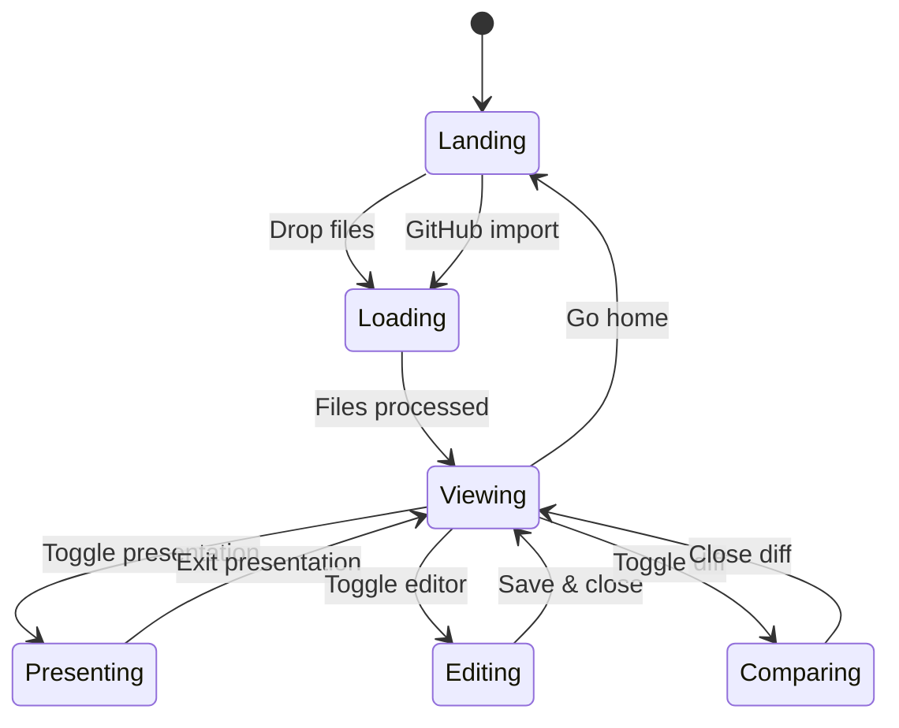

# 📚 API Reference

## MCP Server Tools

The MarkView MCP server exposes **15 tools** for AI assistants:

### Document Operations

```typescript
// Search across all documents
const results = await search_docs({
  query: "authentication flow",
  maxResults: 10
});

// Get a specific document
const doc = await get_document({
  filename: "setup.md"
});

// Create a new document
await create_document({
  filename: "guide.md",
  content: "# Getting Started\n\n..."
});
```

### Analysis Tools

| Tool | Description | Returns |
|------|-------------|---------|
| `get_headings` | Extract heading structure | `TocHeading[]` |
| `get_code_blocks` | Extract code by language | `CodeBlock[]` |
| `get_tables` | Extract tables as JSON | `Table[]` |
| `validate_workspace` | Find broken links | `ValidationResult` |
| `get_links` | Extract all links | `Link[]` |
| `get_stats` | Document statistics | `Stats` |

### Example: Workspace Validation

```json
{
  "tool": "validate_workspace",
  "result": {
    "totalFiles": 12,
    "brokenLinks": [
      {
        "file": "setup.md",
        "link": "missing-page.md",
        "line": 42
      }
    ],
    "orphanFiles": ["unused-draft.md"],
    "status": "2 issues found"
  }
}
```

## State Management



## Error Handling

```typescript
try {
  const html = await renderMarkdown(content);
  const highlighted = highlightHtml(html, theme);
  setHtml(highlighted);
} catch (error) {
  // Graceful fallback: render without highlighting
  console.warn('Rendering error:', error);
  const fallback = await renderMarkdown(content);
  setHtml(fallback);
}
```

> ⚠️ **Note:** All rendering is done client-side. If Shiki or Mermaid fails to load (e.g., due to CSP restrictions in the Chrome extension), MarkView falls back gracefully to plain code blocks.

---

← Back to [Welcome](welcome.md) · [Architecture](architecture.md)
