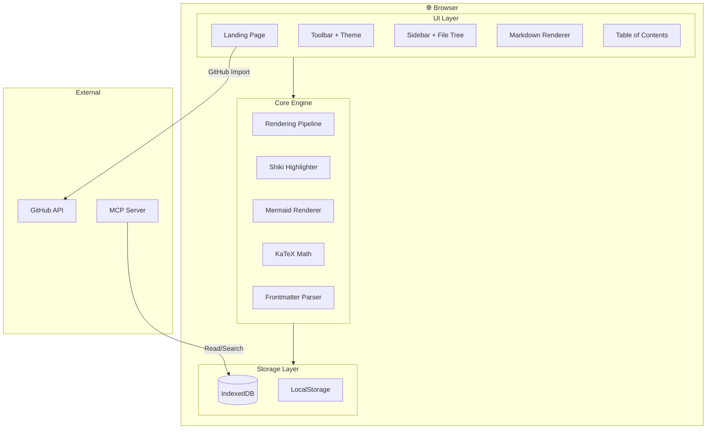
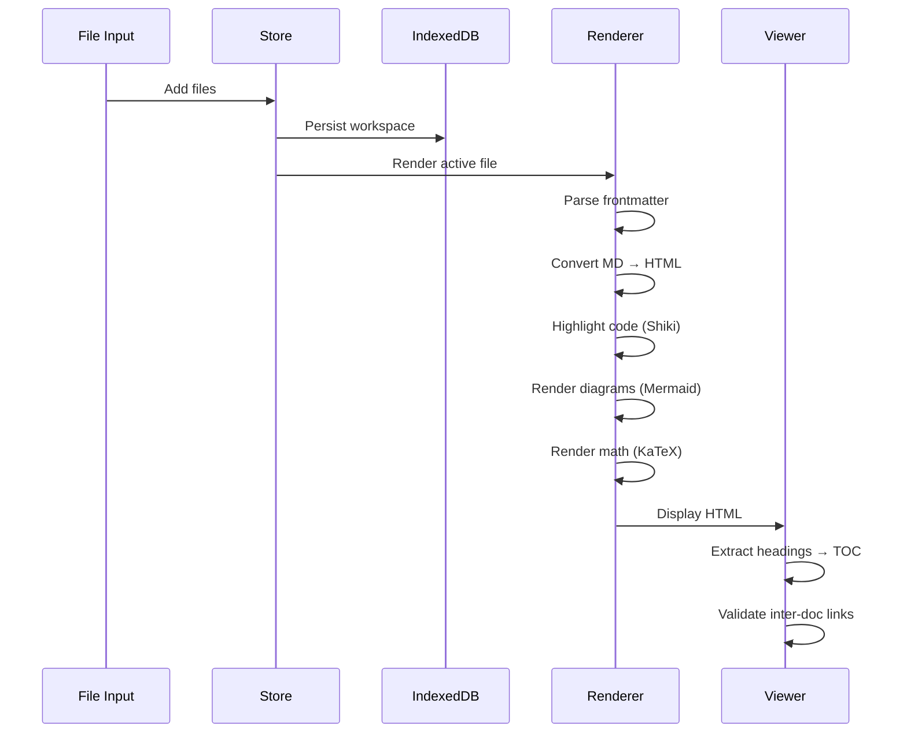
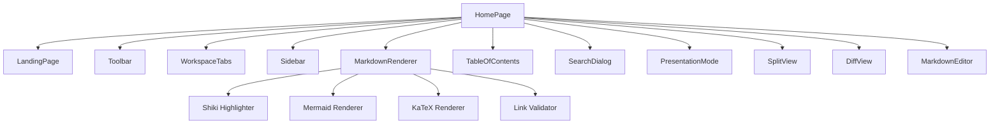

# 🏗️ Architecture Overview

MarkView is built as a **privacy-first**, client-side application. All processing happens in the browser — your files never touch a server.

## System Architecture

## Data Flow

## Technology Stack

| Layer | Technology | Purpose |
|-------|-----------|---------|
| Framework | Next.js 16 | App Router, SSR, API routes |
| Styling | Tailwind CSS 4 | Utility-first CSS |
| State | Zustand | Lightweight state management |
| Storage | Dexie (IndexedDB) | Persistent file storage |
| Markdown | Unified + Remark + Rehype | Rendering pipeline |
| Highlighting | Shiki | Syntax highlighting |
| Diagrams | Mermaid | Flowcharts, sequences, etc. |
| Math | KaTeX | LaTeX formula rendering |
| AI | MCP Protocol | 15 tools for AI assistants |

## Component Tree

---

← Back to [Welcome](welcome.md)
