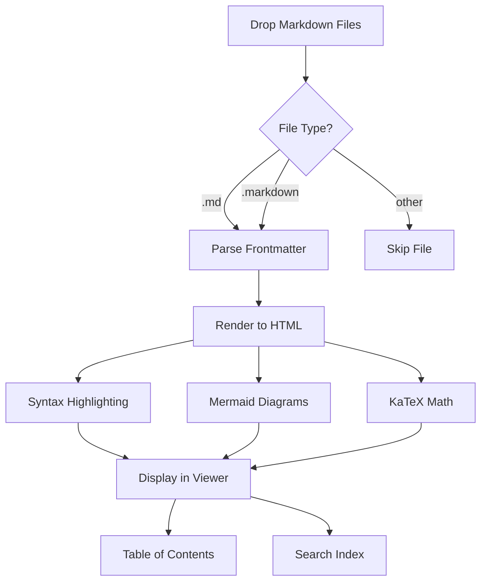
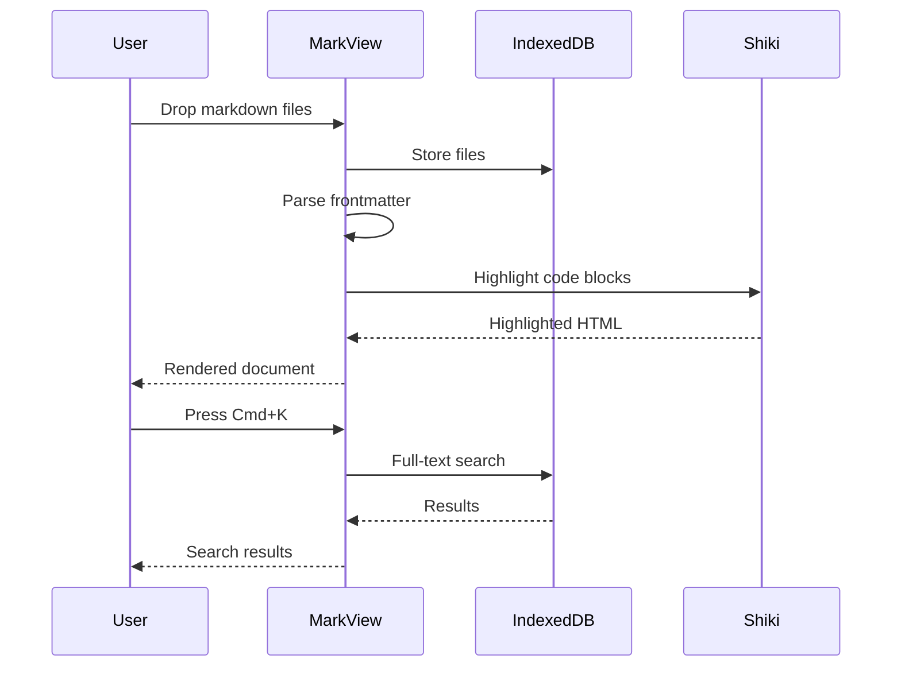
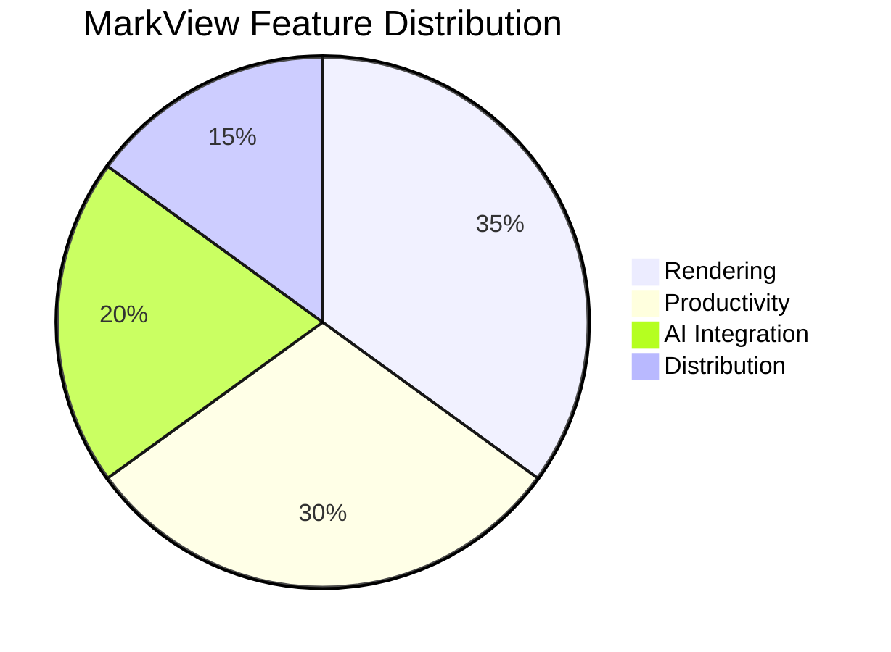
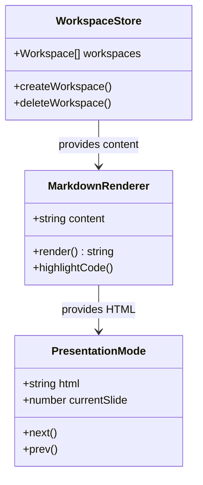

# 👋 Welcome to MarkView

> **MarkView** is the markdown viewer your docs deserve — beautiful rendering, full-text search, presentation mode, and 15 MCP tools for AI assistants.

This is a **demo workspace** showing everything MarkView can render. Use the **sidebar** to navigate between files, or press `⌘K` to search.

---

## 📑 Table of Contents

This document covers:

1. [Text Formatting](#text-formatting)
2. [Code Blocks](#code-blocks)
3. [Tables](#tables)
4. [Mermaid Diagrams](#mermaid-diagrams)
5. [Math (KaTeX)](#math-katex)
6. [Task Lists](#task-lists)
7. [Links & Images](#links--images)

> 💡 **Tip:** The Table of Contents on the right side is auto-generated from headings and highlights your current position as you scroll.

---

## ✍️ Text Formatting

MarkView supports all **GitHub Flavored Markdown**:

- **Bold text** and *italic text* and ~~strikethrough~~
- Inline `code` with syntax highlighting
- [Links](https://github.com) that open in new tabs
- Footnotes[^1] for references

[^1]: MarkView renders footnotes at the bottom of the document.

> **Blockquotes** can contain *any* markdown, including:
> - Nested lists
> - `inline code`
> - And even **nested blockquotes**:
> > Like this one!

---

## 💻 Code Blocks

Code blocks get **Shiki syntax highlighting** with a language badge and one-click copy:

```typescript
interface MarkviewConfig {
  theme: 'dark' | 'light' | 'system';
  fontSize: number;
  focusMode: boolean;
}

async function renderMarkdown(content: string): Promise<string> {
  const html = await pipeline.process(content);
  return html.toString();
}
```

```python
# Python is highlighted too!
import pandas as pd

df = pd.read_csv("data.csv")
summary = df.groupby("category").agg({
    "revenue": ["sum", "mean"],
    "users": "count"
})
print(summary.to_markdown())
```

```bash
# Shell commands with syntax highlighting
git clone https://github.com/abgnydn/markview.git
cd markview && npm install
npm run dev
```

```json
{
  "name": "markview-mcp",
  "tools": 15,
  "features": ["search", "validate", "extract"]
}
```

---

## 📊 Tables

Tables are **sortable** — click any column header to sort:

| Feature | Category | Status |
|---------|----------|--------|
| Syntax Highlighting | Rendering | ✅ Complete |
| Mermaid Diagrams | Rendering | ✅ Complete |
| KaTeX Math | Rendering | ✅ Complete |
| Full-text Search | Productivity | ✅ Complete |
| Presentation Mode | Productivity | ✅ Complete |
| Split View | Productivity | ✅ Complete |
| Diff Comparison | Productivity | ✅ Complete |
| Built-in Editor | Editing | ✅ Complete |
| MCP Server (15 tools) | AI Integration | ✅ Complete |
| PWA Support | Distribution | ✅ Complete |
| Chrome Extension | Distribution | ✅ Complete |

---

## 🔀 Mermaid Diagrams

### Flowchart



### Sequence Diagram



### Pie Chart



### Class Diagram



---

## 🧮 Math (KaTeX)

MarkView renders **LaTeX math** via KaTeX. Inline math: $E = mc^2$ and $\sum_{i=1}^{n} i = \frac{n(n+1)}{2}$.

Block math for the quadratic formula:

$$x = \frac{-b \pm \sqrt{b^2 - 4ac}}{2a}$$

Maxwell's equations:

$$\nabla \cdot \mathbf{E} = \frac{\rho}{\varepsilon_0}$$

$$\nabla \times \mathbf{B} = \mu_0 \mathbf{J} + \mu_0 \varepsilon_0 \frac{\partial \mathbf{E}}{\partial t}$$

---

## ✅ Task Lists

- [x] Set up Next.js 16 with App Router
- [x] Implement markdown rendering pipeline
- [x] Add Shiki syntax highlighting
- [x] Build Mermaid diagram support
- [x] Create KaTeX math rendering
- [x] Build full-text search with ⌘K
- [x] Add presentation mode
- [x] Implement split view & diff
- [x] Create MCP server with 15 tools
- [ ] World domination

---

## 🔗 Links & Images

### Inter-document Links

Check out the other demo files in this workspace:

- [Architecture Overview](architecture.md) — system design with Mermaid diagrams
- [API Reference](api-reference.md) — code examples and tables

### External Links

- [GitHub Repository](https://github.com/abgnydn/markview)
- [Next.js Documentation](https://nextjs.org/docs)

---

## ⌨️ Keyboard Shortcuts

| Shortcut | Action |
|----------|--------|
| `⌘K` | Open search |
| `⌘B` | Toggle sidebar |
| `⌘\` | Toggle focus mode |
| `⌘+` / `⌘-` | Adjust font size |
| `↑` / `↓` | Navigate files |
| `Esc` | Close overlays |

---

*Built with ❤️ by the MarkView team. Your files never leave the browser.*
