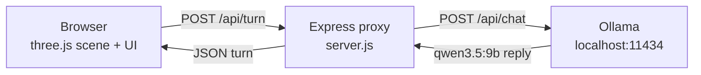

# Founder Lab 🦉

> a multi-agent meeting room

Founder Lab is a working demo of a multi-agent advisory panel for early-stage founders. Four named AI agents — a synthesizer, a critic, a market researcher, and a financial modeler — discuss a founder's business idea live in a 3D meeting room rendered with three.js. Every reply is generated by a real local LLM (Ollama, default `qwen3.5:9b`) running on the founder's own machine. No cloud calls. No telemetry. The transcript is yours, exportable as markdown.

## Quickstart

```
ollama serve &
ollama pull qwen3.5:9b
npm install
PORT=3001 npm start
# → http://localhost:3001
```

That's it. Open the URL, pick a topic chip (or type your own), hit **Start**, and watch four agents argue about your idea.

## What you'll see

- **Four agents** seated around a 3D conference table, each with their own color, name plate, and speaking-indicator glow.
- **A 3D meeting room** built in three.js — orbit-controls camera, soft lighting, real geometry, no game engine.
- **Real LLM dialogue** — each turn is a fresh Ollama call against the persona's system prompt. Nothing is canned.
- **Fade-in transcript** alongside the room. Each line streams in as the agent finishes speaking.
- **Exportable as markdown** — the **Copy Transcript** button drops a fully formatted meeting log into your clipboard, ready to paste into Notion, Obsidian, or email.
- **Demo mode** — for offline showings (bad wifi at a conference, on a plane, etc.), a canned transcript plays in the same UI. The audience cannot tell the difference.

## The four agents

The personas are defined in `public/personas.js` and are modeled on the [Virtual Lab](https://www.nature.com/articles/s41586-024-08144-y) PI-plus-specialists pattern.

| Name | Role | Voice example |
|---|---|---|
| **Founder-PI** | Synthesizer who runs the room | *"I hear two things — Market-Researcher says we have a wedge, Financial-Modeler says CAC will eat us. Which one breaks first?"* |
| **Scientific-Critic** | Falsification-first skeptic | *"You said 'huge market.' Define the slice you can serve in year one — by city, by spend, by substitute. If no answer would change your mind, this isn't a hypothesis, it's marketing."* |
| **Market-Researcher** | Voice of the actual customer | *"Ops managers at mid-market logistics firms already pay $400/month for FreightWaves. 'No competitors' usually means no buyers — name the five interviews that would prove me wrong."* |
| **Financial-Modeler** | Unit economics or it didn't happen | *"$400/month ARPU is fine — but at $1,200 CAC and 8% monthly churn, payback never lands. Which number do you believe is wrong?"* |

Each persona constrains itself to 2–3 sentences, max 60 words, addresses other agents by name, and refuses preamble. The result is a meeting that feels like a meeting — not four chatbots taking turns.

## Architecture



The browser runs the entire UX: the 3D room, the transcript pane, the topic chips, the speaking-indicator state machine. The Express server is a thin proxy whose only job is to hold the persona system prompts and forward turns to Ollama. Ollama runs on the founder's machine; nothing leaves the box.

## Stack

- **three.js** — loaded as ESM from a CDN, no build step
- **Express** — single-file proxy in `server.js`
- **Ollama** — local LLM runtime, default model `qwen3.5:9b`
- **Vanilla ES modules** — no React, no bundler, no framework lock-in

The whole demo is roughly: one HTML file, three JS modules in `public/`, and one Node file. You can read it in a sitting.

## Why local-first

Founder ideas are sensitive. A pre-seed founder who's about to discuss their unannounced startup with four AI advisors does not want that conversation logged on someone else's server, reviewed for trust-and-safety, or reused as training data. Founder Lab runs entirely on `localhost`: zero network calls leave the founder's machine once the model is pulled.

The personas can also be swapped to Anthropic Claude (or any OpenAI-compatible provider) with one change in `server.js` — useful for deployments where the host already has an enterprise agreement with a cloud provider, but the default posture is local.

## Roadmap

- **Cohort sharing via Veil** — founders opt-in to share anonymized meeting summaries with their cohort, using the [ternary-veil](../) sensitivity-routing layer.
- **Settings UI** — pick the model (Llama, Qwen, Mistral, Claude), adjust meeting length, swap personas in/out without editing JS.
- **Multi-meeting workspace** — sidebar of past meetings, search across transcripts, "follow up on last week's open question" prompt.
- **Persona authoring** — let coaches define their own four-agent panels (a "Pam panel," a "YC panel," a "deep-tech panel").

## Credits

Made for **Pam Hoelzle** and [howtostartsomething.com](https://howtostartsomething.com) — a wedge into the Entrepreneur Ready **Gold tier**, giving every cohort founder a weekly multi-agent panel meeting modeled on Pam's six-phase roadmap, while preserving Pam's Platinum 1:1 coaching as the premium offering.

The persona structure (PI + specialists + critic) and the always-run-the-critic discipline come from the brain stack at `~/brain/agents/` — in particular `Scientific-Critic.md`, the falsification-first skeptic that refuses to let a claim past without naming the evidence that would falsify it.

## License

MIT-style; demo, not yet production-licensed.
