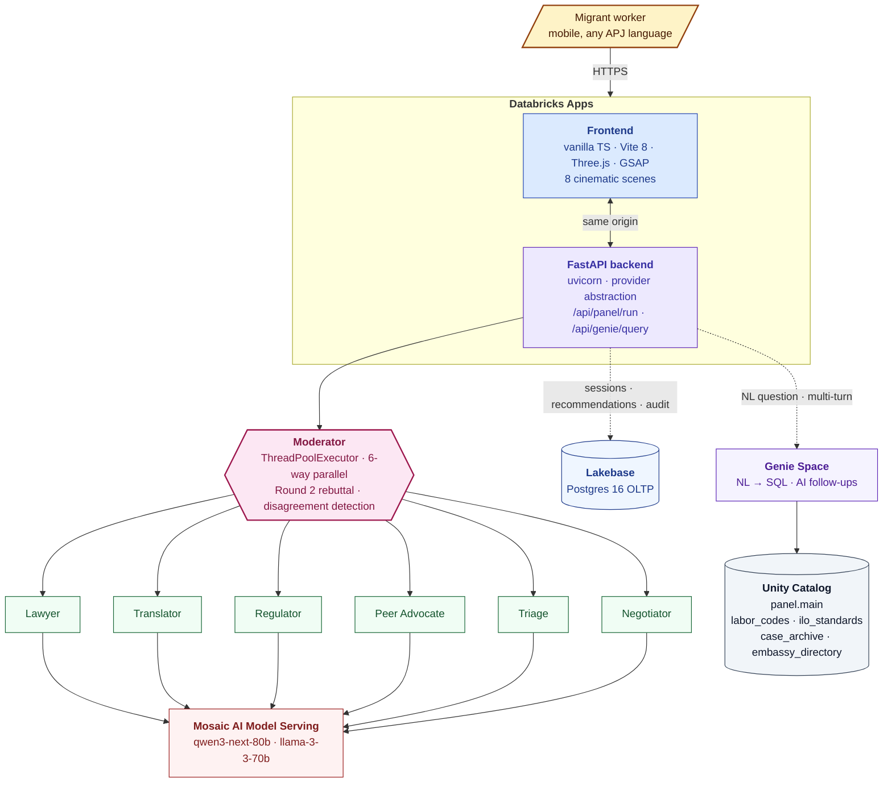

<div align="center">

# Panel

### *A panel of AI specialists that reads your contract, in your language, and tells you what's wrong with it.*

[](https://databricks.com)
[](https://www.databricks.com/product/machine-learning/mosaic-ai)
[](https://www.databricks.com/product/lakebase)
[](https://www.databricks.com/product/genie)
[](LICENSE)

[**Live app**](https://panel-7474659131504222.aws.databricksapps.com) · [**Spec**](docs/spec.md) · [**Demo script**](docs/demo-script.md)

</div>

---

## The intervention has to happen before signing

> Ten million Filipinos work abroad. Seven hundred thousand Indonesians leave the country for work each year.
> Most sign their employment contract — in English or Arabic, drafted by the destination employer — without ever reading it in their own language.
> Once they fly, the asymmetry hardens: kafala-tier visa systems tie their status to the employer; embassy hotlines are unfamiliar; their phone, passport, and movement may not be theirs.

That gap is what Panel exists to close.

---

## What Panel does

A worker pastes their employment contract, picks their mother tongue, and writes one sentence about their situation.

Six specialist AI agents read the contract **in parallel**, **publicly disagree** where their views diverge, run a Round 2 rebuttal turn, and converge on a single recommendation in the worker's L1 — accompanied by a four-phase checklist, a negotiation script, and an offline-takeable letter.

> **The disagreement is the product.** Single-agent contract analyzers are commodity. A panel that visibly debates its own conclusions is what makes the recommendation trustworthy.

### The six agents

| Agent | Role |
|---|---|
| **Lawyer** | Maps each clause to the destination-country labor code. Verdict per clause: lawful / gray-area / unlawful, with statute citation. |
| **Translator** | Renders the contract and findings in the worker's mother tongue. Flags semantic ambiguities in the translation itself. |
| **Regulator** | Scores against ILO C97 / C143 / C181 / C189 / C190 and the ASEAN Rights-Based Standard. |
| **Peer Advocate** | Pattern-matches each clause against an anonymised archive of past cases. |
| **Triage** | Detects ILO trafficking indicators. Routes urgent cases to embassy / NGO contacts. |
| **Negotiator** | Coaches the worker for the pre-signing conversation: priority pushback, questions in L1 + EN, red-flag recruiter responses, walk-away threshold. |

### What the worker walks away with

1. **A letter in their mother tongue** — TL;DR + urgency score 0 → 10
2. **A negotiation script** — what to say, in L1 and EN, for the priority clause
3. **A four-phase checklist** — before departure / on arrival / during employment / exit-emergency
4. **Concrete refusals + pushbacks** — clauses to refuse outright, clauses to ask to amend, with suggested replacement language
5. **A what-if simulator** — toggle which amendments the recruiter accepts; see urgency drop in real time
6. **Offline artifacts** — Markdown / PDF download, WhatsApp share, QR-encoded embassy vCard
7. **The systemic view** — multi-turn Genie chat over the open-data corpus + NGO aggregate dashboard

---

## Architecture



All four Databricks pillars load-bearing. Single-bundle deploy.

---

## How the pillars are used

| Pillar | Where it's load-bearing | What breaks if removed |
|---|---|---|
| **Databricks Apps** | The whole product — FastAPI + cinematic frontend deployed as one app, authenticated via the workspace OAuth flow. | No way for the worker to reach the system. |
| **Mosaic AI Model Serving** | All six agents, the Round 2 rebuttal turn, and the AI follow-up generator for the Genie chat. | No agent outputs. Empty product. |
| **Lakebase (Postgres 16)** | Session persistence, worker records, per-agent message log, final recommendations. Powers the NGO-aggregate dashboard. | No memory across the conversation; no dashboard; no audit trail. |
| **Genie** | The "Ask the lawbook" scene — multi-turn NL queries over four Unity-Catalog tables, with three AI-generated follow-up suggestions per turn. | Systemic-view scene goes silent. |
| **Unity Catalog** | All four Genie-backed tables governed under `panel.main`. App service principal granted `USE_CATALOG` + `USE_SCHEMA` + `SELECT` per-table. | No data access for Genie; chat returns permissions error. |

---

## Demo corridor

| Corridor | Worker L1 | Status |
|---|---|---|
| Philippines → Saudi Arabia | Tagalog | **Primary hero** — Maria, 23, domestic worker. Live-in 3-yr term, SAR 750/mo probation, SAR 15K recruitment debt + SAR 5K performance bond, passport surrendered, explicit embassy-contact ban. |
| Indonesia → Malaysia | Bahasa | Secondary |
| Philippines → Hong Kong | Tagalog | Sample loaded |
| Indonesia → Singapore | Bahasa | Sample loaded |
| Philippines → UAE | Tagalog | Sample loaded |
| Clean / Mild / Trafficking | EN | Across the severity spectrum |

---

## Repo layout

```
panel/
├── databricks.yml              Asset Bundle — app + Lakebase + warehouse + endpoints + Genie space
├── README.md                   This file
├── docs/
│   ├── spec.md                 Submission spec (architecture, pillars, rubric, legal posture)
│   └── demo-script.md          5-minute scene-by-scene voiceover + actions
├── app/
│   ├── api/server.py           FastAPI entry — /api/panel/run, /api/genie/query, /api/samples
│   ├── agents/                 Six agent modules + moderator + rebuttal + checklist
│   │   ├── moderator.py        Orchestrates the panel — parallel run, Round 2, synthesis
│   │   ├── lawyer.py / translator.py / regulator.py
│   │   ├── peer_advocate.py / triage.py / negotiator.py
│   │   ├── disagreement.py     Cross-agent tension detection
│   │   ├── rebuttal.py         Round 2 — agents see each other and push back
│   │   └── checklist.py        4-phase pre-departure synthesiser
│   ├── providers.py            LLM provider abstraction (mosaic / anthropic / openai / mock / …)
│   ├── providers_mosaic.py     Mosaic AI Model Serving client
│   ├── genie_client.py         Multi-turn Genie + AI follow-up suggester
│   ├── store.py                Lakebase persistence
│   ├── cache.py                Disk-backed response cache (schema-versioned)
│   ├── samples.py              Demo contract registry
│   ├── data/demo_contracts/    Eight sample contracts
│   └── static/                 Built frontend (generated by build_and_deploy.sh)
├── web/                        Cinematic TS frontend (Vite + Three.js + GSAP)
│   ├── src/scenes/             Cold open · intake · deliberation · reel · negotiation · recommendation · genie · dashboard
│   ├── src/api/panel.ts        Talks to the FastAPI backend
│   └── package.json            npm run dev / build
└── scripts/
    └── build_and_deploy.sh     vite build → copy → bundle validate → deploy → restart
```

The cinematic frontend lives in `web/`: vanilla TypeScript + Vite 8 + Three.js + GSAP, no framework. `scripts/build_and_deploy.sh` runs the Vite build, copies the static `dist/` into `app/static/`, validates the Databricks bundle, deploys, and restarts the app.

---

## Deploy

```bash
./scripts/build_and_deploy.sh
```

That's the whole deploy. The script validates the bundle, uploads the source code to the workspace, restarts the app, and prints the live URL.

---

## Run locally

Backend:

```bash
cd app
uv pip install -r requirements.txt
PANEL_LLM_PROVIDER=mock uvicorn api.server:app --reload
```

Frontend (in `web/`):

```bash
cd web
npm install
npm run dev
```

The Vite dev server proxies `/api/*` to `http://127.0.0.1:8000`.

---

## Provider abstraction

| Provider | Env | Notes |
|---|---|---|
| `mosaic` | `PANEL_LLM_PROVIDER=mosaic` | **Production default.** Mosaic AI Foundation Models on Databricks Serving. |
| `anthropic` | `ANTHROPIC_API_KEY=sk-ant-…` | Claude family |
| `openai` | `OPENAI_API_KEY=sk-…` | GPT family |
| `gemini` | `GEMINI_API_KEY=…` | Gemini family |
| `lmstudio` | `LMSTUDIO_BASE_URL=http://…` | Local models via LM Studio |
| `claude_cli` | `claude` CLI on `$PATH` | Uses your existing Claude Code auth |
| `mock` | — | Demo-quality canned responses, zero network |

Same agent code runs against any of them. Swap by changing one env var.

---

## Legal posture

> Panel provides **informational guidance only.** It is not legal advice.

- Every output — every agent's findings, every recommendation, every translation — is paired with a disclaimer in the worker's L1.
- The Triage agent always surfaces at least one **non-employer** contact (embassy 24-h hotline, NGO, in-country legal aid) for urgent cases.
- Worker consent is **opt-in** for any contribution to the case archive. The default is private-session — responses stored under a per-session UUID, not under the worker's name.
- No personally identifying details (name, passport number, exact addresses) are sent to LLM providers. The contract text is sent verbatim because that's what the agents read; demo contracts are anonymised.

---

## Team

**Marketing Delphi (Singapore)**

- **Ahmet Baris Gunaydin** — owner. Architecture, agents, backend, deploy.
- **Anne Lazarakis** — co-founder. Originated the Negotiator agent — *"telling someone their contract is bad is useless unless you also tell them what to say."* The single most differentiating piece of the panel.

---

<div align="center">

Built for the [Databricks "Building Intelligent Apps" Hackathon](https://www.databricks.com/dataaisummit) — APJ region, Track 1 (Social Impact), May 2026.

[**panel-7474659131504222.aws.databricksapps.com**](https://panel-7474659131504222.aws.databricksapps.com)

</div>
