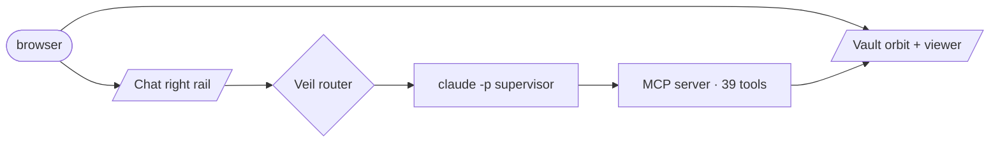

<!-- SPDX-License-Identifier: Apache-2.0 -->

# tether-brain

[](https://github.com/abgnydn/tether-brain/actions/workflows/ci.yml)
[](https://github.com/abgnydn/tether-brain/actions/workflows/codeql.yml)
[](LICENSE)

> **Open the brain. Stay in the tab.**

Local-first browser brain. One URL, no install. SolidJS + WebGPU on Cloudflare. The right rail is a persistent agent that lives inside the page — and the privacy layer decides which model gets to see what before the message ships.

- [tether.dev](https://tether.dev) — the public brain
- [zerotvm.com](https://zerotvm.com) — the experimental WGSL backend

## Install (persistent agent)

The browser surface works with no install. To wire the persistent `claude -p` supervisor:

```bash
curl tether.dev/setup | bash       # macOS / Linux
irm tether.dev/setup.ps1 | iex     # Windows
```

TCC-safe — refuses to install under `~/Documents/`. Drops a launchd plist, systemd user unit, or Scheduled Task at `~/.tether-brain/`. Uninstall: `--uninstall`.

## 5-minute tour

Walk through every surface in five minutes — vault orbit, chat agent, kernel benches, temple, DavaKasası: see [`pitch/DEMO_SCRIPT.md`](pitch/DEMO_SCRIPT.md). Read with screen-share open; eleven click cues, two type cues.

## What's inside

- **39 MCP tools** — 31 vault/system (13 read, 6 write ask-15m, 5 analyze, 4 sessions, 2 temple, 1 Bash always-ask) + 5 graph extras + 3 audit (`audit_search`, `audit_export`, `audit_aggregate`). Up to **20 Iris comms tools** (Slack + Gmail) when keys are wired.
- **5 WGSL kernels** — `cosineSim`, `topK` (per-workgroup bitonic), `forceLayoutStep`, `tfidfSpMV`, `kHopBFS`. 1M-doc cosine similarity in ~2 ms compute on the user's GPU. Live at `/dev/notes`, `/dev/search`, `/dev/orbit`.
- **5 Veil adapters** — WebLLM, Anthropic, Zero-TVM, OpenAI-compat (Ollama / LM Studio / vLLM), transformers.js. Public goes clean; private cohort-blends; secret never leaves.
- **5 ingest formats** — md, txt, docx (mammoth), pdf (pdfjs-dist), csv/xlsx (SheetJS), UYAP `.udf` (JSZip + cp1254 RTF — DavaKasası unblocked).
- **Brain agent** — persistent `claude -p` supervisor with alive-on-spawn, exp-backoff cap 30 s, abort-on-disconnect, crash-safe pending slot, SSE stream with tier badges + tool-call cards.
- **DavaKasası sibling** — same engine, KVKK profile, TR locale, audit-as-home, ₺500/ay. Separate Cloudflare Pages deploy, one codebase.

## Architecture



Full inventory — surfaces, kernels, adapters, storage, deploy — in [`INDEX.md`](INDEX.md).

## Develop

```bash
bun install
bun run dev          # SolidJS SPA   :5173
bun run dev:mcp      # Hono MCP      :5417
```

## Test

```bash
bun run typecheck    # ts strict, 9 workspaces
bun run test         # unit (veil 58 · ingest 17 · viewer 18 · mcp ~50)
bun run test:e2e     # Playwright (gate temple behind RUN_TEMPLE_E2E=1)
```

## Deploy

Cloudflare Pages + Workers + Durable Objects + R2 + KV. Provision once, then `git push main`:

```bash
bun run provision:cf   # wrangler login + R2 + KV + DO bindings (~30 min, one-time)
git push origin main   # .github/workflows fire — Pages SPA + share + yjs Workers
```

Set `CLOUDFLARE_API_TOKEN` and `CLOUDFLARE_ACCOUNT_ID` as repo secrets. Details in [`INDEX.md`](INDEX.md#next-concrete-moves).

## License

Apache-2.0. See [`LICENSE`](LICENSE). Source files carry `SPDX-License-Identifier: Apache-2.0` headers.

This project includes third-party software listed in [`NOTICE`](NOTICE) and [`THIRD-PARTY-LICENSES.md`](THIRD-PARTY-LICENSES.md).

## How the build happened

Athena multi-spawn — four sequential spawns, each fanning into 7–14 parallel streams (28 total). Every stream got a canonized persona: Zeus (orchestration), Talos (Zero-TVM), Hephaestus (forge), Hestia (first-run + audit), Iris (comms), Themis (KVKK), Asclepius (resilience). Specialists ship at the same time, one INDEX.md merge point. Days, not months. Files at [`_pantheon/`](_pantheon/).
