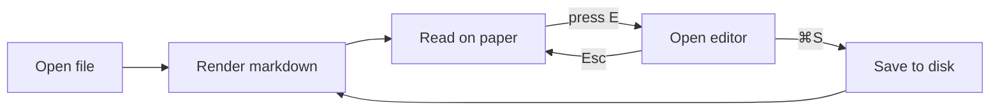
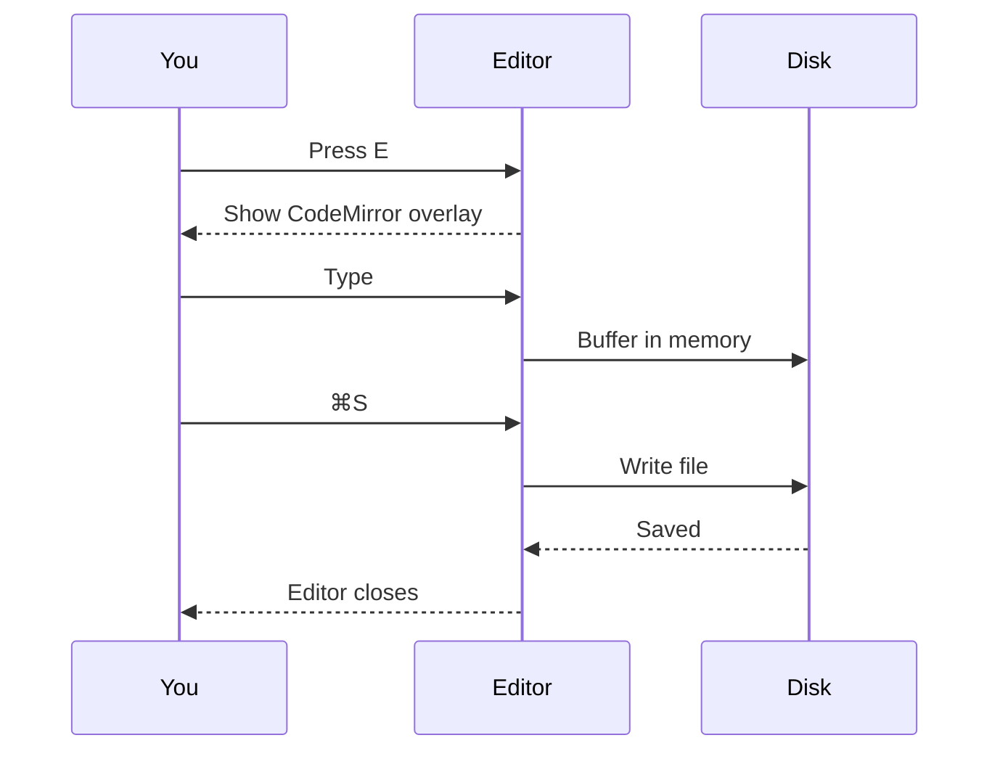
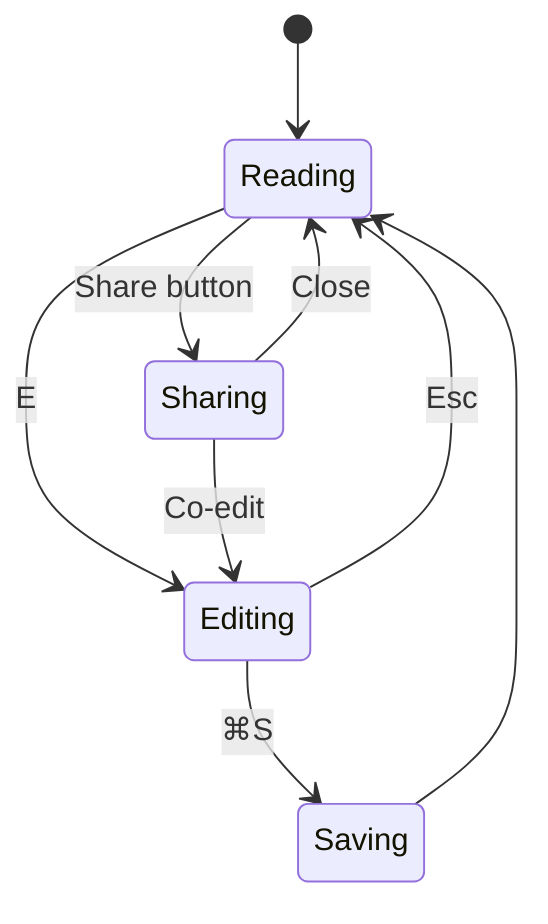
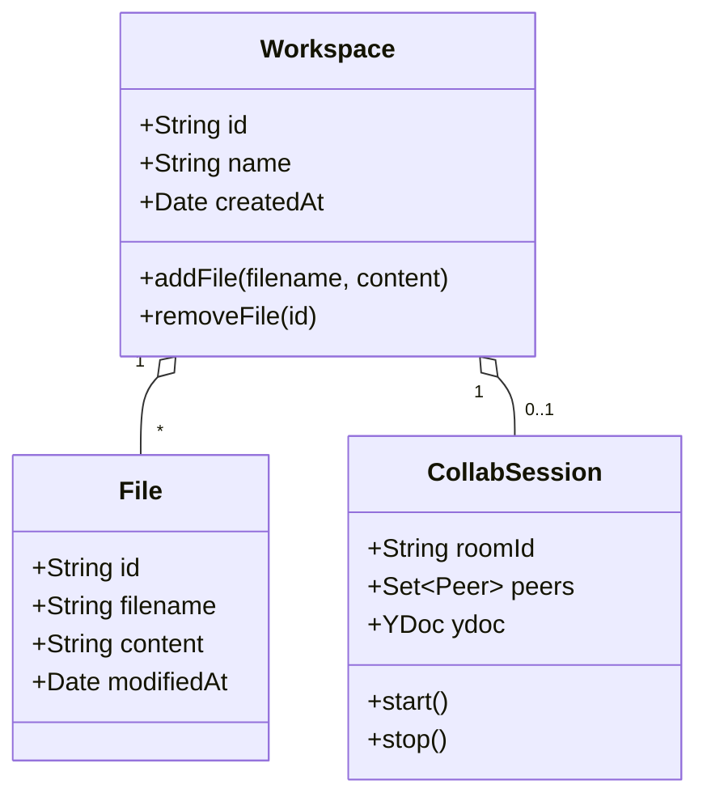
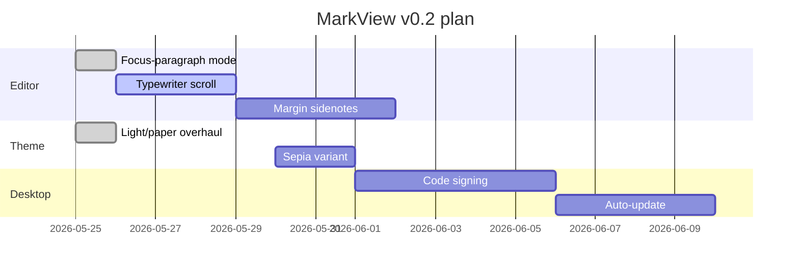
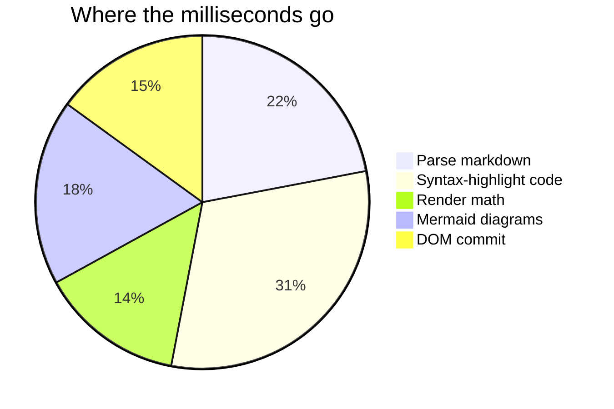

# Diagrams

Mermaid renders inline. Diagrams live next to the prose that argues for them — they're paragraphs in another language, not appendices.

## Flowchart

The basic editing loop: open a file, read it, drop into the editor, save, return to reading.

## Sequence

What happens between you, the editor, and the disk when you save a file:

## State

The reading / editing / sharing states of a single file:

## Class

The data model that backs a workspace:

## Gantt

A small project plan, the sort of thing a markdown editor handles natively:

## Pie

A rough split of where time goes in a markdown app:

